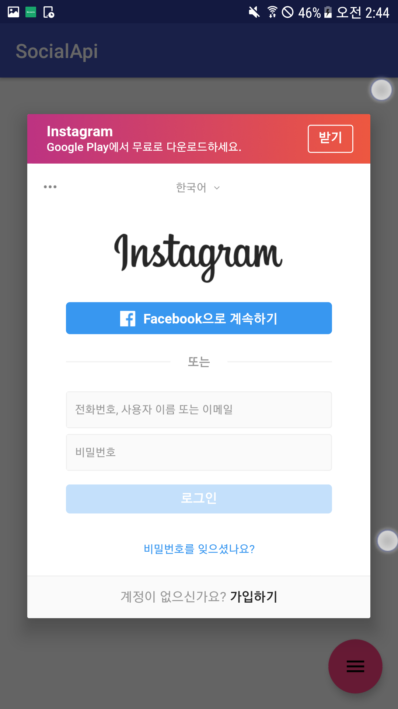
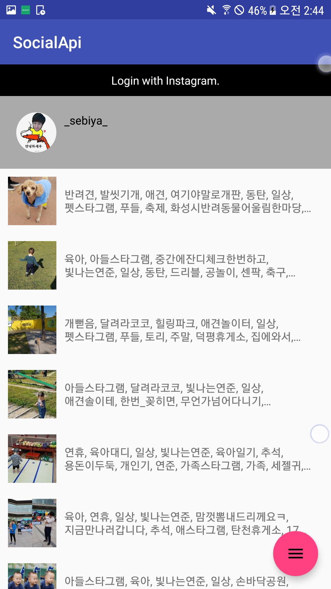

# social-api

Retrofit interface for instagram, band, etc (social api)

[](https://jitpack.io/#kshdreams/social-api)


##### GETTING STARTED
social-api releases are available via JitPack.
```ruby
// Project level build.gradle
// ...
repositories {
    maven { url 'https://jitpack.io' }
}
// ...

// Module level build.gradle
dependencies {
implementation 'com.github.kshdreams:social-api:0.2.1'
}
```


#### How To Use
The most basic case is as follows:

##### Login (Auth)
```java
InstagramLogin.with(getFragmentManager())
        .withClientInfo(InstagramClientInfo.CLIENT_ID,
                InstagramClientInfo.REDIRECT_URI)
        .show();
```

and target Activity or Fragment should implements ```AuthCallback```
```java
public class MainActivity extends AppCompatActivity implements AuthCallbacks<String> {
    @Override
    public void onAuthCompleted(final String authToken) {
        // TODO : call api using token
    }
```



##### Use API
```java
public interface InstagramApi {
    @GET("/v1/users/self")
    Single<Response<UserInfo>> userSelf(@Query("access_token") String token);

    @GET("/v1/users/self/media/recent")
    Single<Response<List<UserMedia>>> userSelfRecentMedia(@Query("access_token") String token);
}

private InstagramApi mInstagramApi = new InstagramApiImpl();

mInstagramApi.userSelf(instagramToken)
        .subscribeOn(Schedulers.io())
        .observeOn(AndroidSchedulers.mainThread())
        .subscribe(new Consumer<Response<UserInfo>>() {
            @Override
            public void accept(final Response<UserInfo> userInfoResponse) throws Exception {
                // show profile info
                showProfile(userInfoResponse.getData().getUserName(),
                        userInfoResponse.getData().getProfilePicture());
            }
        }, new Consumer<Throwable>() {
            @Override
            public void accept(final Throwable throwable) throws Exception {

            }
        });
```


## License
```
Copyright 2018 kshdreams

Licensed under the Apache License, Version 2.0 (the "License");
you may not use this file except in compliance with the License.
You may obtain a copy of the License at

   http://www.apache.org/licenses/LICENSE-2.0

Unless required by applicable law or agreed to in writing, software
distributed under the License is distributed on an "AS IS" BASIS,
WITHOUT WARRANTIES OR CONDITIONS OF ANY KIND, either express or implied.
See the License for the specific language governing permissions and
limitations under the License.
```
